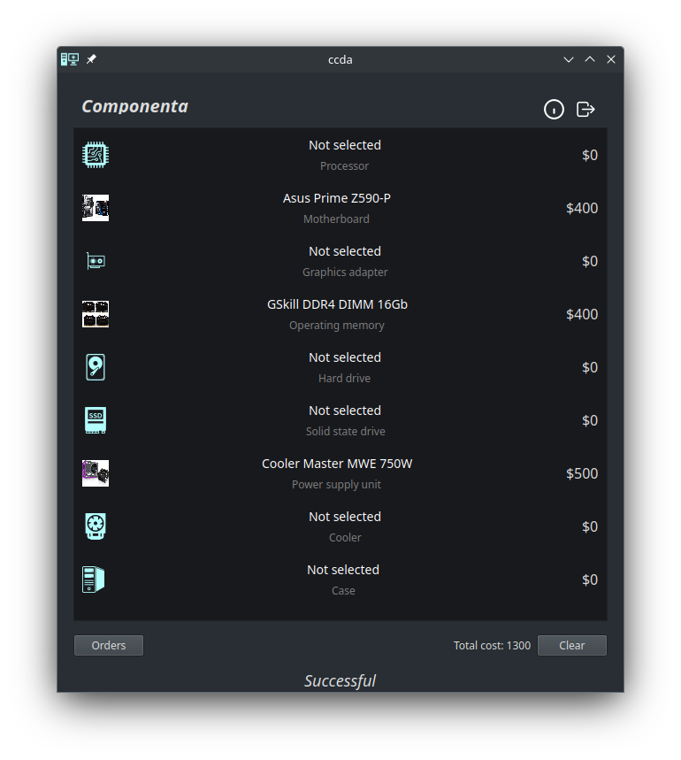
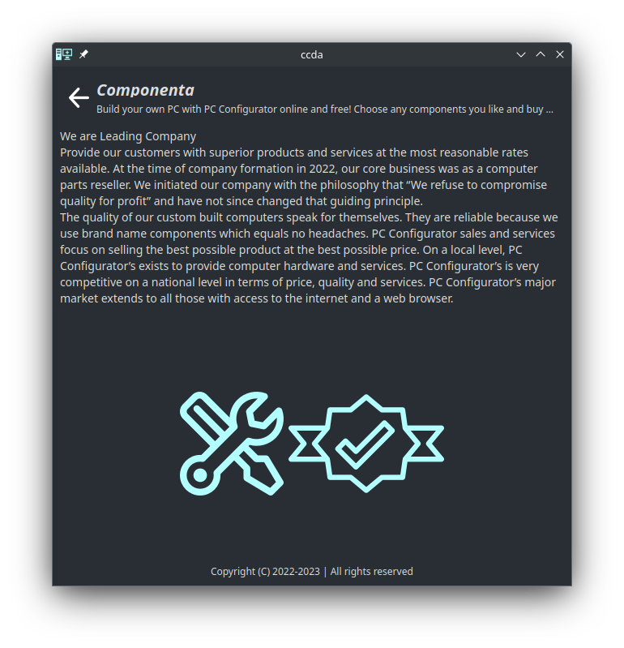
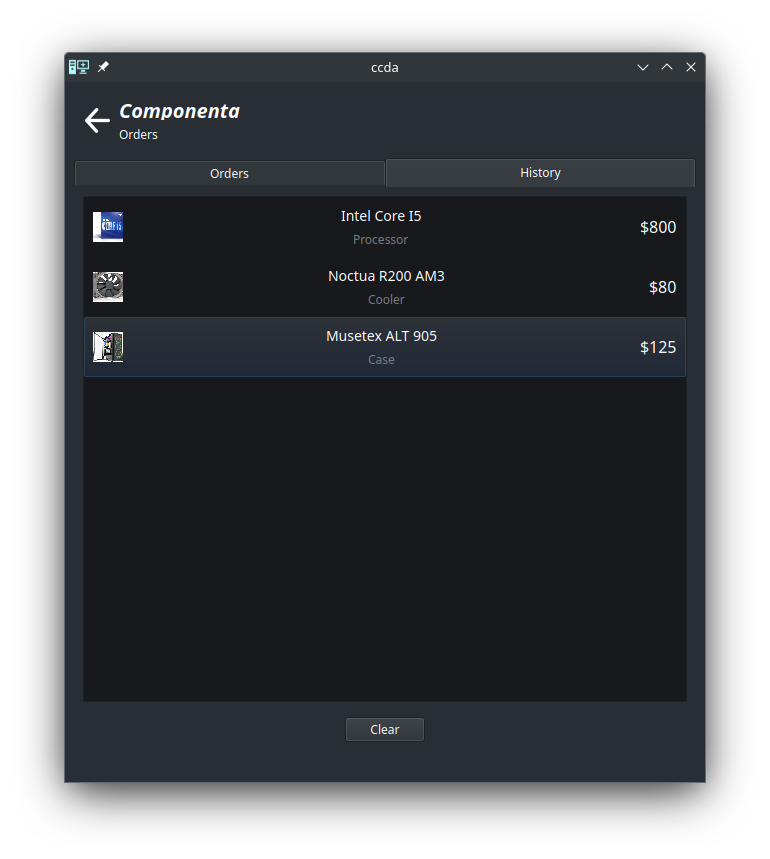

```
 ____                                                               __               
/\  _`\                                                            /\ \__            
\ \ \/\_\    ___     ___ ___   _____     ___     ___      __    ___\ \ ,_\    __     
 \ \ \/_/_  / __`\ /' __` __`\/\ '__`\  / __`\ /' _ `\  /'__`\/' _ `\ \ \/  /'__`\   
  \ \ \L\ \/\ \L\ \/\ \/\ \/\ \ \ \L\ \/\ \L\ \/\ \/\ \/\  __//\ \/\ \ \ \_/\ \L\.\_ 
   \ \____/\ \____/\ \_\ \_\ \_\ \ ,__/\ \____/\ \_\ \_\ \____\ \_\ \_\ \__\ \__/.\_\
    \/___/  \/___/  \/_/\/_/\/_/\ \ \/  \/___/  \/_/\/_/\/____/\/_/\/_/\/__/\/__/\/_/
                                 \ \_\                                               
                                  \/_/                                               
```

This is a QT (C++) port of the [Mobile client](https://github.com/vadniks/ComputerComponentsAndroidApp) 
for desktop systems. The [Server](https://github.com/vadniks/ComputerComponentsWebApp2_back) 
is required for this client-side application.

## Build
To build the application with CLang compiler on Linux machine 
just execute the following commands from the repository root:
```shell
mkdir build && cd build
cmake .. && make all
chmod +x build/ccda
```
After successful build the executable will be located in the `build` folder.

## Screenshots








